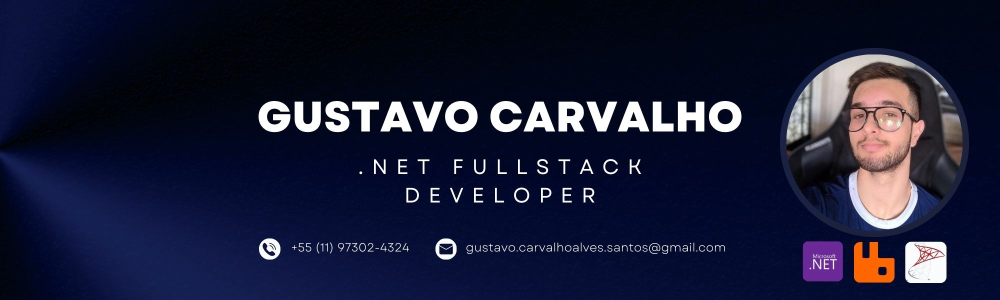
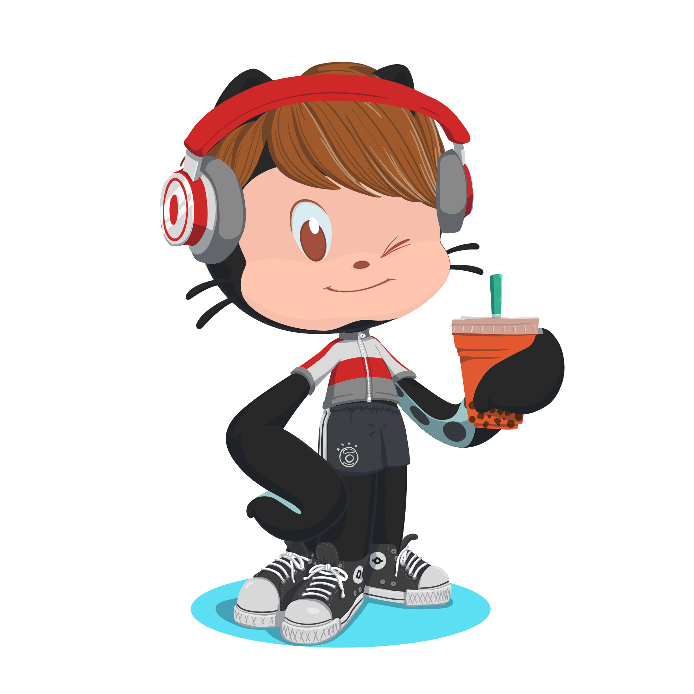

<h1 style="text-align: center;">🚀 Explore My Developer Journey!</h1>
<!-- Add your background image here -->

<h2 style="text-align: center;">About Me</h2>
<ul>
  <li>🔧 FullStack .NET Developer</li>
  <li>💻 Proficient in C#, .NET Core, SQL Server</li>
  <li>🚀 Experience with Docker, RabbitMQ, Redis, MongoDB, SQL Server, React.js, Vue.js, javascript, typescript</li>
  <li>🎓 Currently pursuing a Bachelor's degree in Information Systems at UNESP (top 3 in the class)</li>
  <li>🛠️ Completed Technical Development Systems course at ETESP</li>
  <li>🌍 Open to new opportunities and collaborations</li>
</ul>

 
  
  
  
  
  
  
  
  
  
  
  
  

## 📊 GitHub Stats

  

## 📜 Recent Commits

  

## 👤 Connect with Me

  
  

  

